# ECサイト

## 使用技術

- **PHP**
- **Laravel**
- **JavaScript**
- **Docker**
- **docker-compose**
- **MySQL**
- **Ajax**

## アカウント別機能

### 編集者

| 機能                   | 説明   | 画像                                                    |
|------------------------|--------|---------------------------------------------------------|
| 商品の追加             | 商品を新規に追加ができます。 | 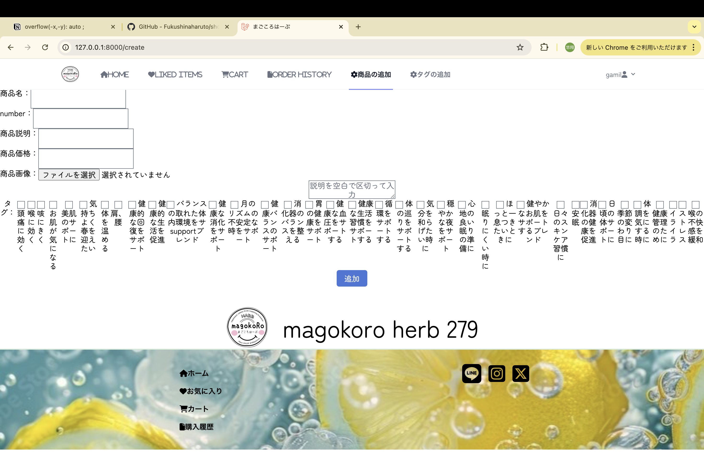               |
| 商品削除               | 商品を削除ができます。       |              |
| 絞り込み検索のタグ作成 | 絞り込み検索の使用するタグを作成することができます。 | 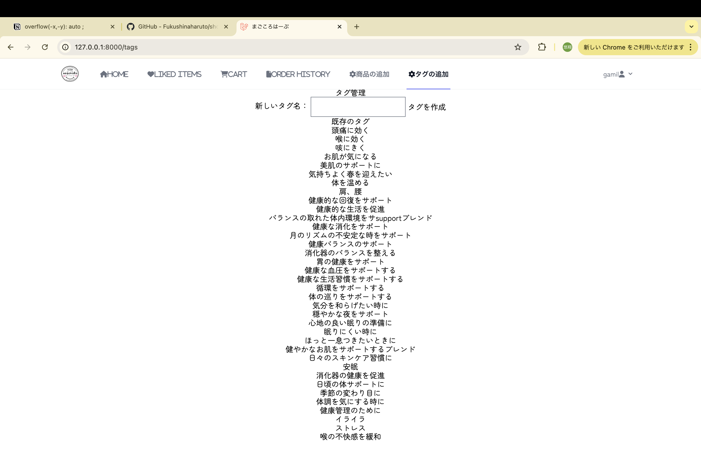           |

### 顧客 (未ログイン者)

| 機能                      | 説明   | 画像                                                   |
|---------------------------|--------|--------------------------------------------------------|
| 新規登録                  | 新規登録ができます。 | 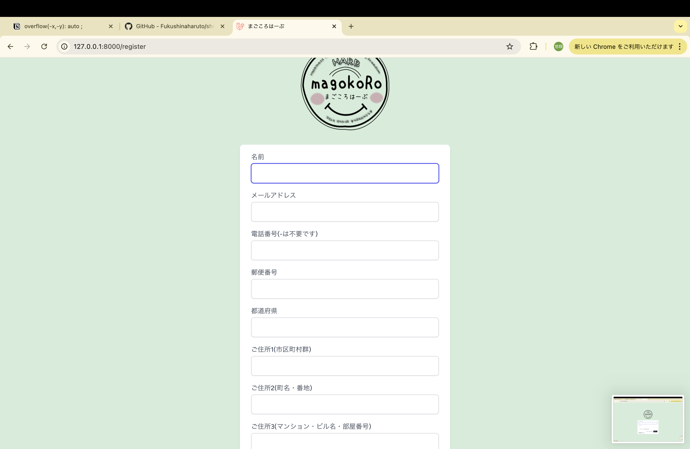               |
| ログイン                  | ログインができますできます。 | 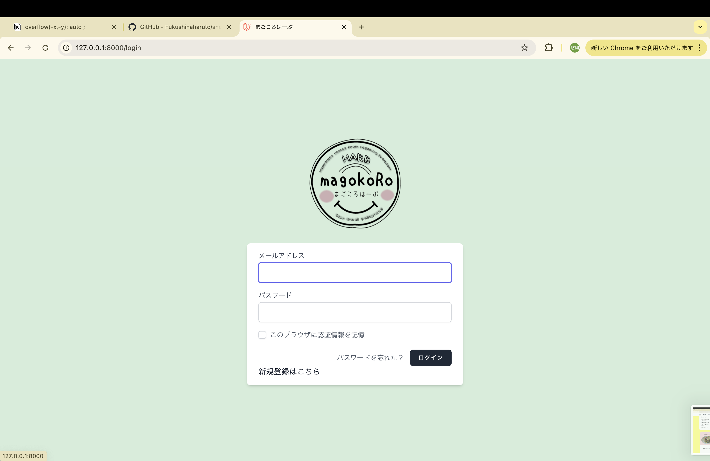                |
| 商品一覧                  | 商品の一覧を観覧できます。商品は横スライダーします。     | 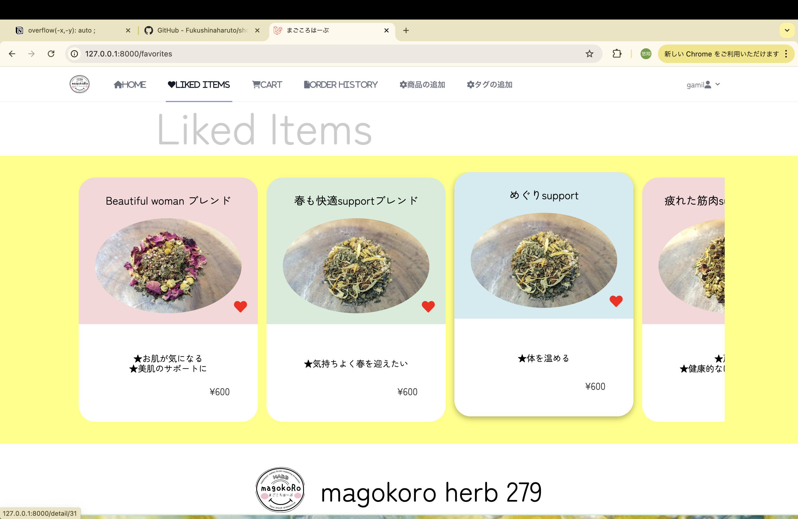           |
| 商品詳細ページの観覧      | 各商品の詳細ページを観覧できます。 | 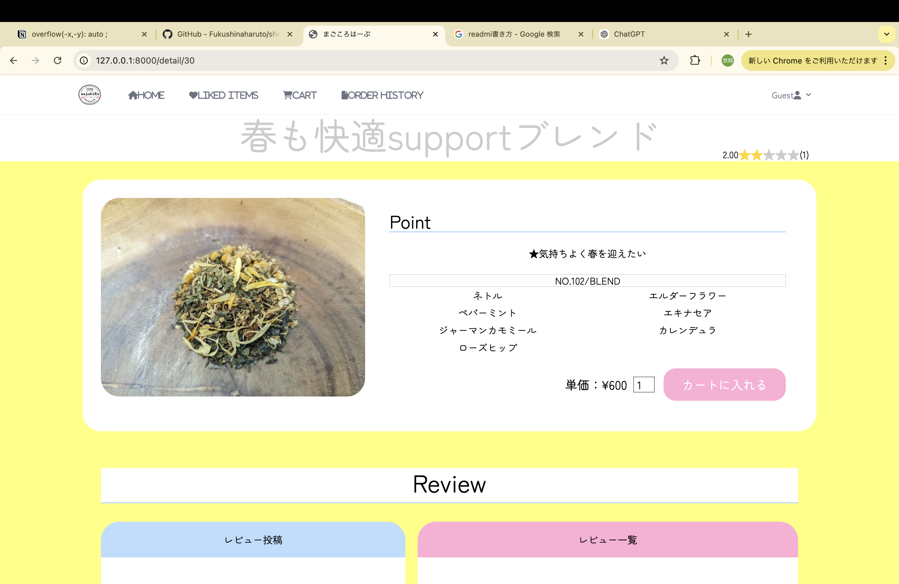                |
| カートに追加, 数量の変更, 削除 | カートに商品を追加、数量を変更、または削除します。 | 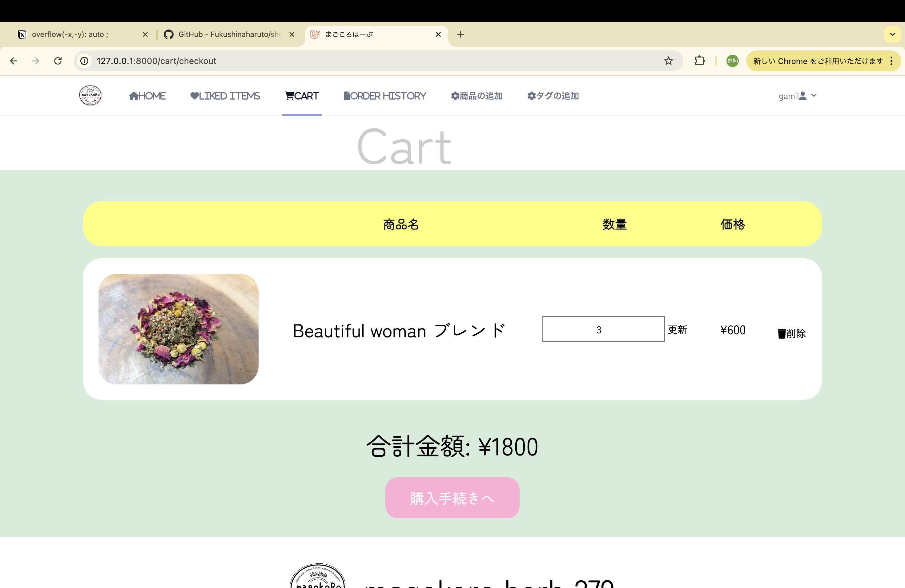 |
| 商品名検索   | 商品名検索と絞り込みを両方適用したまま検索できます。    |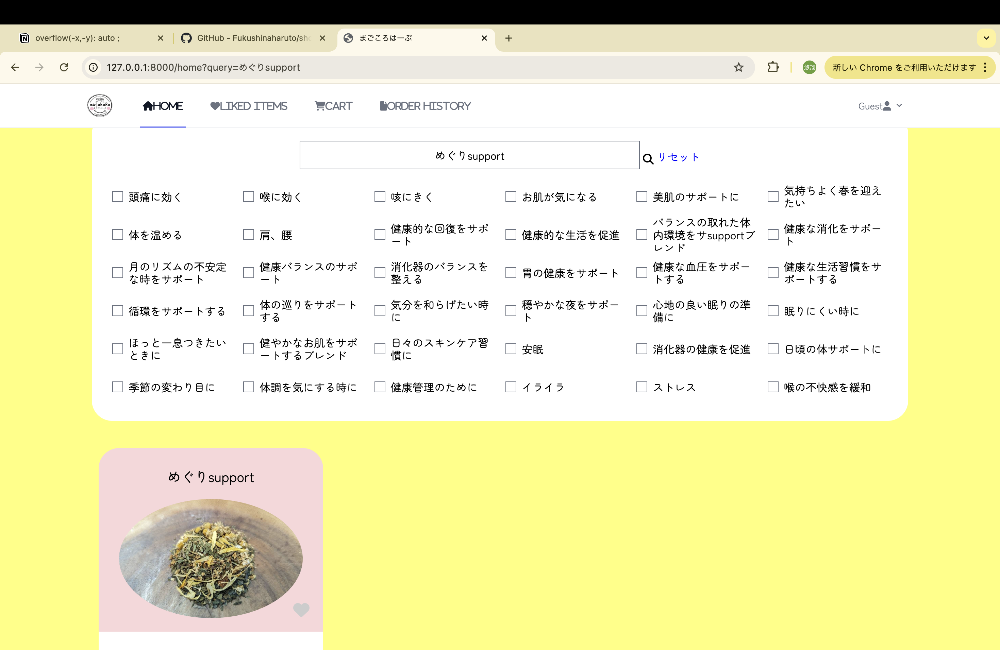 |
| 絞り込み検索  | 商品名検索と絞り込みを両方適用したまま検索できます。  | 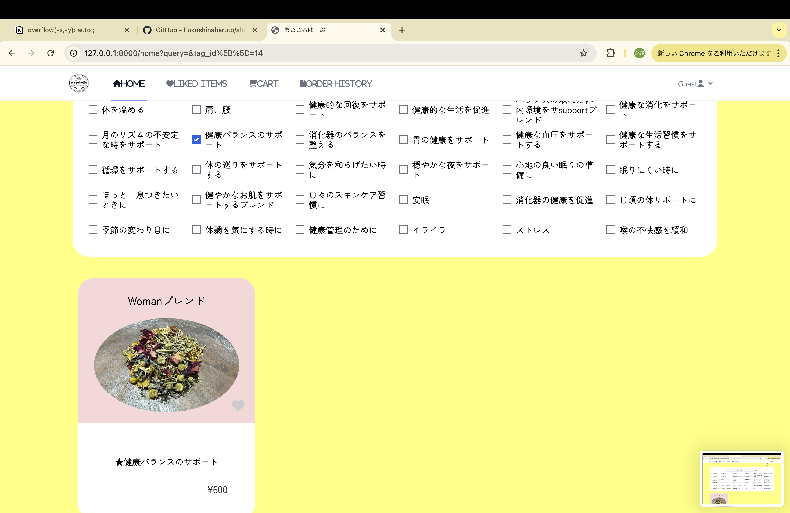 |

### 顧客 (ログイン者)

| 機能                              | 説明   | 画像                                                    |
|-----------------------------------|--------|---------------------------------------------------------|
| カートに入っている商品の購入確定, 数量の変更, 削除 | カート内の商品の購入を確定、数量を変更、または削除します。 | 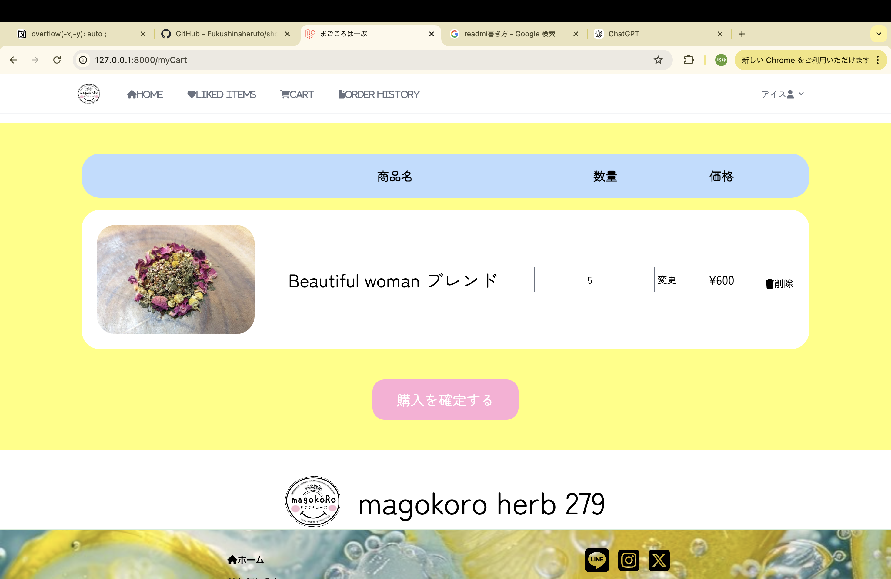 |
| 購入履歴                          | 過去の購入履歴を表示します。 | 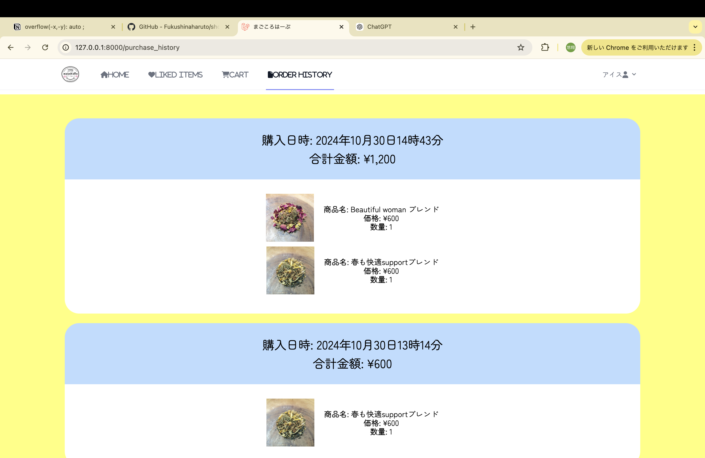          |
| お気に入り登録                    | 商品をお気に入りに登録します。非同期処理なので、ハートをつけても、再読み込みしません。 | 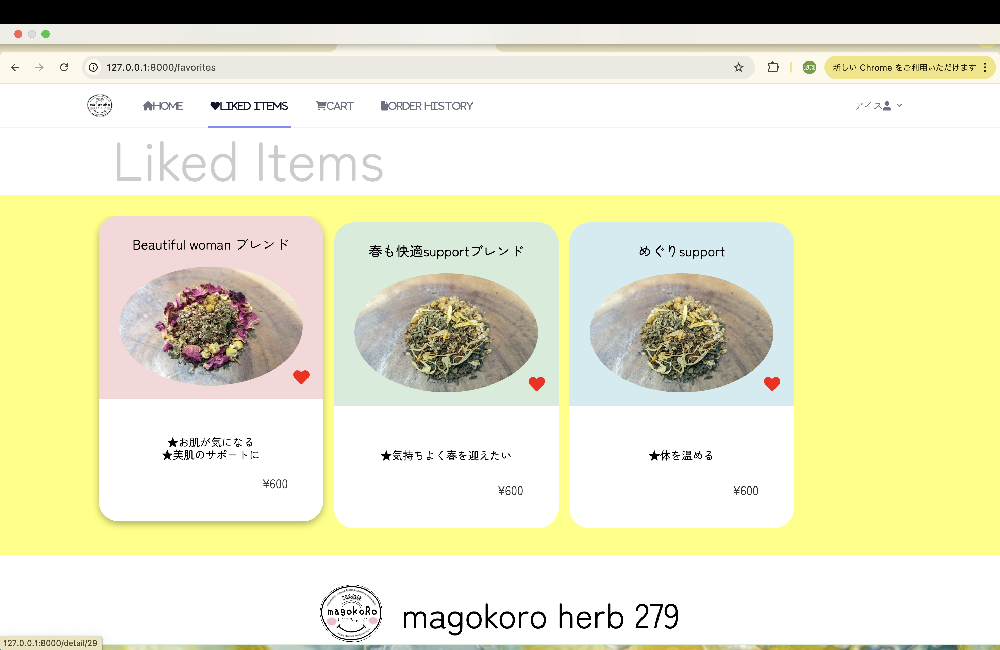            |
| アカウント情報の変更              | アカウント情報を編集します。 | 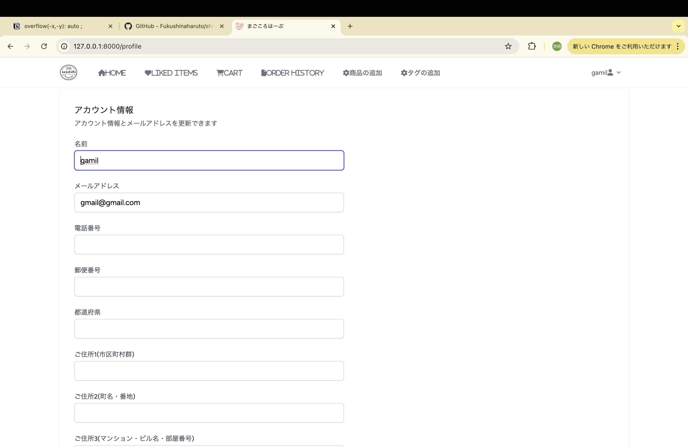      |
| レビュー,コメント,商品の評価        | 商品のレビューをすることができます。商品の評価を見ることができます。コメントを書くことができます。コメントは購入者のみ書くことができます | 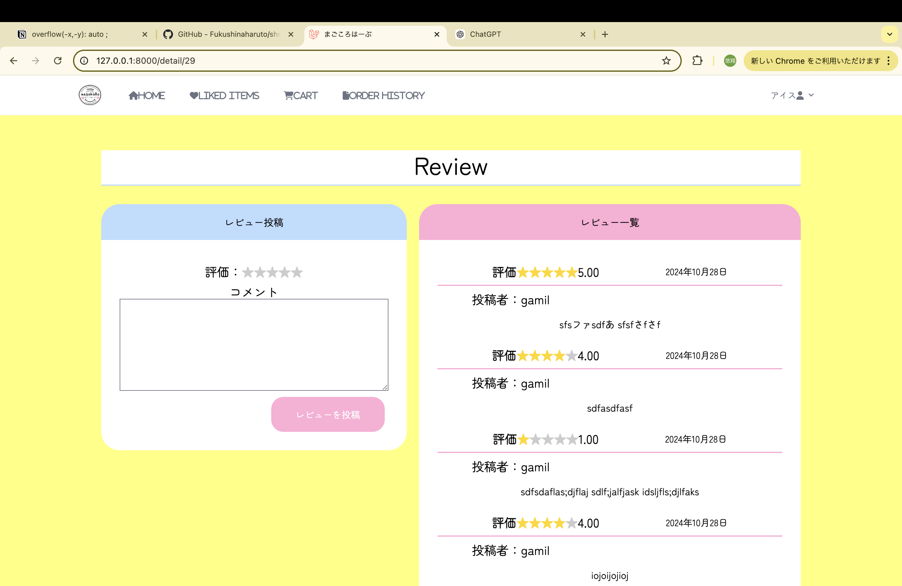 |

## 今後追加しようとしている機能

- **新規登録時のメールの認証機能**  
  ユーザーが新規登録した際に、登録確認用のメールを送信し、認証を行う機能。

- **お問い合わせフォーム**  
  サイト利用者が管理者に問い合わせできるフォーム。

- **ご利用案内**  
  サイトの利用方法やFAQをまとめたガイドページ。

- **特定商取引法表示**  
  特定商取引法に基づく情報を表示するページ。

- **TLSで保護**  
  サイト全体の通信をTLSで暗号化し、セキュリティを強化。
